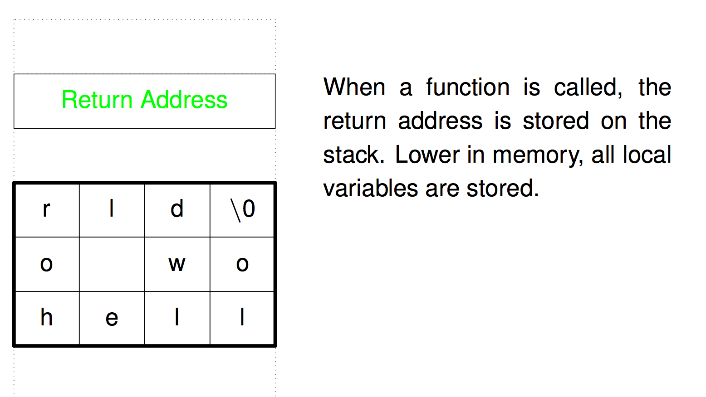
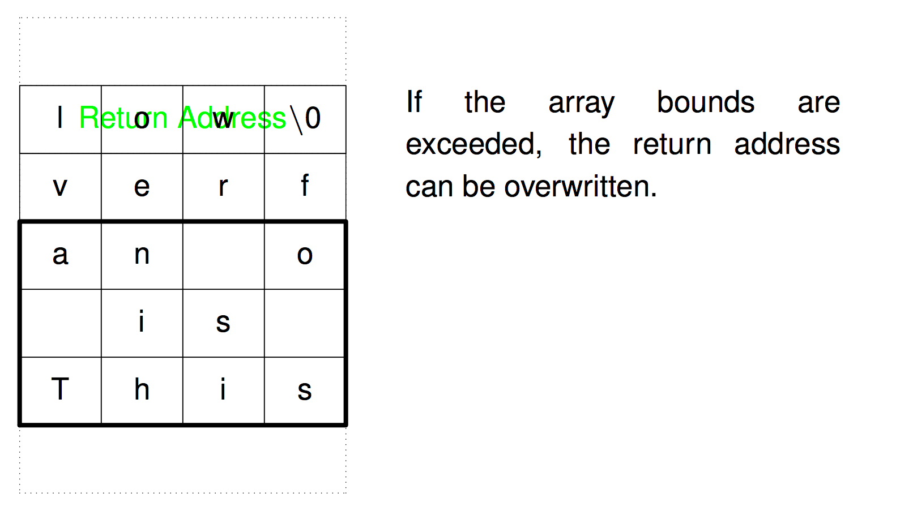
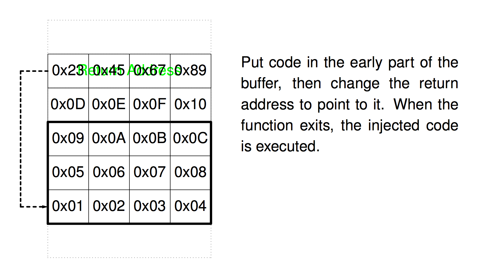
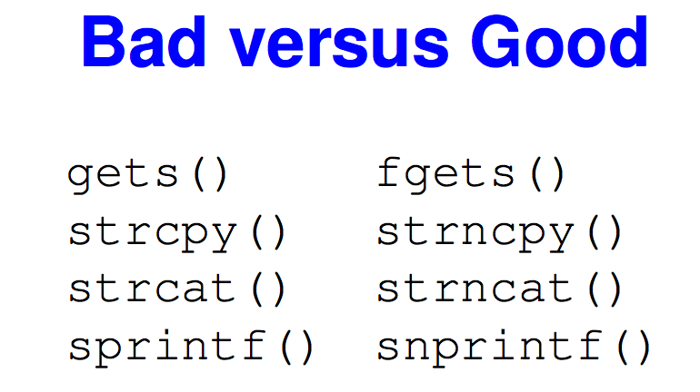

# Buffer overflow

### Bad code example (4.3BDS `fingerd` command)
```
char line[512];
...
gets(line);
```
### Indirect buffer overflow
> `f` doesn't even know the size of array!
```
void f(char *s) {
    sprintf(s, "....");
}
void g() {
    char buf[128];
    f(buf);
}
```

### Java vs. C.
* Java, C#, Go check array bounds
* More or less everything but C and C++ check







