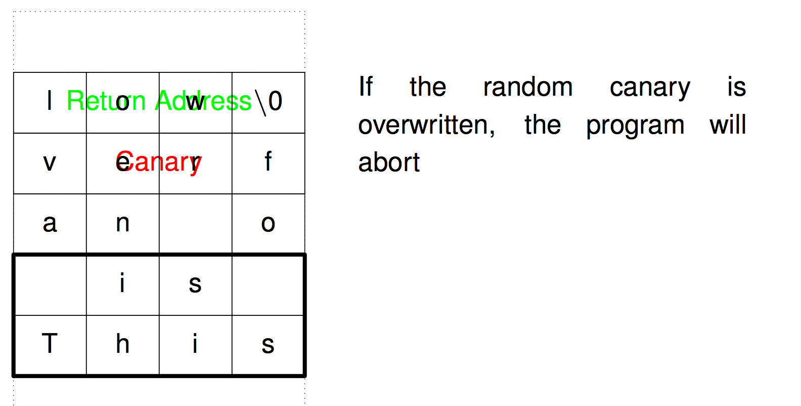

# Buffer Overflow Protections

## Canaries
> Buffer overflow protection

* Insert a random “canary” value between the return address and the rest of the stack frame.
* Check if it’s intact before returning. Abort if changed.
* Any stack-smash attack will have to overwrite the canary to get to the return address.
* Use a different random value each time the program is executed.

## Address Randomization
> Address Space Layout Randomization

* Put stack at `different random location` each time program is executed
* Put heap at different random location as well
* `Good`: defeat attempts to address known locations
* `Bad`: make debug harder 