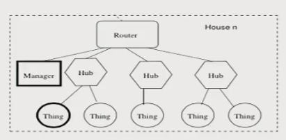
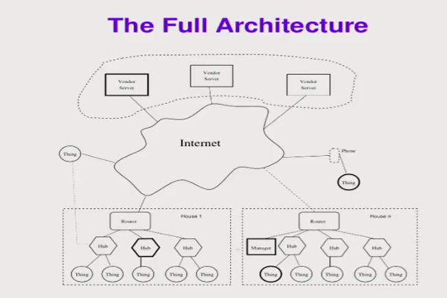

## Internet of Things (IoT) Architecture

* Things talk to `Hubs`.
* `Hubs` talk to `Vendor Sever`.
* `Manger` talk to `Things` via `Hubs`.
* Things don't always have right interface with Internet.

### Home IoT

* Local managers (maybe a phone app) talk to hubs.
* Hubs talk to devices via private protocols.
* Hubs talk to vendor servers.
* Things may talk to each other via hubs, but probably use the `vendor servers`.
* `Vendor servers` may talk to each other.

### Vendor Servers
* Many devices cannot be called directly (e.g. Nest thermostats).
* Devices may not have CPU power for some tasks (e.g., voice recognition on Amazon Echo, speech recoginition is costly task, Echo sends data to server).
* Vendors like to gather data.

### Privacy and IoT
> Please be aware that if your spoken words include personal or other sensitive information, that information will be among the data captured and transmitted to a third party.

* [Smart TV that records personal data](http://www.brennancenter.org/analysis/im-terrified-my-new-tv-why-im-scared-turn-thing)

### Security of loT architecture

Any component can be attacked: `things`, `hubs`, `servers`, `links`.

> How to hack each component? Who can hack (component)? What are the consequences (of component being hacked)?

#### Link Security
* E.g. home WiFi networks
* Easy to encrypt links
* Primary source of a compromised link: devices at either end of I/O, say, a corrupted firmware.

#### Ownership
* E.g. who can control my Nest thermostat?
* E.g. if I sell my house to other people, should I still have control over the Nest thermostat of that house?
* Many smart devices have little or no user interface.

#### Authentication
* `Thing-to-Hub`, `Hub-to-Server`, `Server-to-Server` authentication.
* How do Things connected to different Hubs and different Servers authenticate each other?
* Complex cryptographic protocols may be necessary.
* If `Things` are corrupted, private data collected by the `Thing` are in danger.
* E.g. My health monitor is corrupted, falsely reporting that my blood pressure is off the charts, I may falsely go to doctor right away.

#### Access Control
* E.g. my smart doorknot needs complex access control: who can open the door? How to customize my guests, or cleaning staff coming to my house?
* In general, setting access control rules properly is very hard.
* `Authorization should not happen on the servers`.

#### Corrupted Servers
* `Biggest risk`: corrupted firmware - but can be digitally signed.
* Can send evil commands to `Things`.

### Protection of IoT artchitecture

#### Request Filters
* Sanity Filters: e.g Nest thermostats reject temperatures that go outside certain ranges.
* Bad commands / sequences of bad commands continue to emerge as more features on `Thing` are being added.

#### Cryptography
* Neccessary, but not sufficient.
* Encrypt message.

#### Intrusion Detection
* Detect ongoing attacks or other compromised components.
* E.g. alter the owner if a sanity filter is used.
