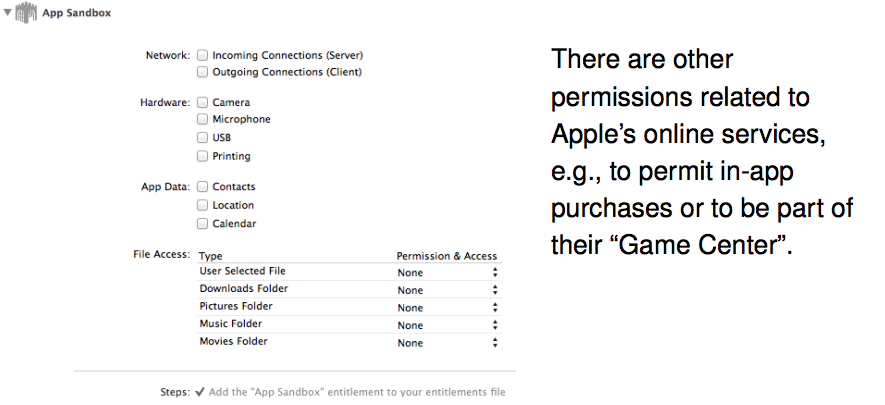

## Sandbox
### MacOS App Sandbox
* Requested permissions are specified at compile time
* Permissions (and the program) are part of a digitally signed object; system can verify the signature at execution time
* Fairly simple set of permissions to allow access to certain files
* App cannot request other files outside of its sandbox directory
* Programs sold via Apple’s App Store must use sandboxing

### HTML5 Sandboxing
* HTML5 allows IFRAMEs to be sandboxed
* Plugins, applets, etc., are disabled
* Cookies aren’t shared with the sandbox
* No pop-ups, new browser windows, etc.

### Windows Sandboxing
* Some apps (e.g., Internet Explorer, Adobe Acrobat Reader) split into trusted/untrusted halves; the untrusted half is sandboxed
* Many add-on programs to run arbitrary applications in a sandbox
* “Metro” apps on Windows 8 are sandboxed