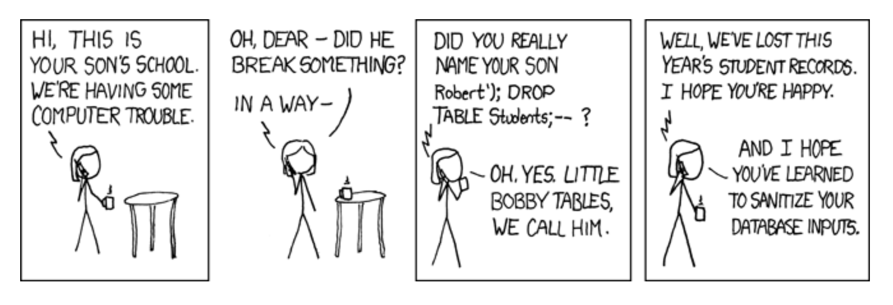

# secure-sensitive program
> Program that runs with one set of permissions and accepts input from somone with different (especially lesser) permissions

### SQL injection
* If you invoke an external program, be aware of its parsing rules (language semantics).
* Especially serious for languages like Shell, Perl, and Python, where data can be converted to statements and executed.

### Internal Field Separator (IFS)
> For many command line interpreters (“shell”) of Unix operating systems, the internal field separator (abbreviated IFS) refers to a variable which defines the character or characters used to separate a pattern into tokens for some operations.

* The shell variable IFS lists the delimiters used when parsing command lines.
* If you can change it, you can control the shell’s parsing.

### Some sensitive environment variables
* `PATH`
    - If “.” is first,, you’ll execute a command in the current directory. What if it’s booby-trapped?
* `ENV`: a file to execute on startup
* `LD_LIBRARY_PATH`: The search path for shared libraries
* `LD_PRELOAD`: Extra modules loaded at runtime