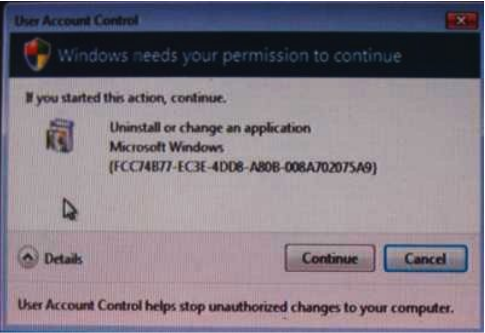
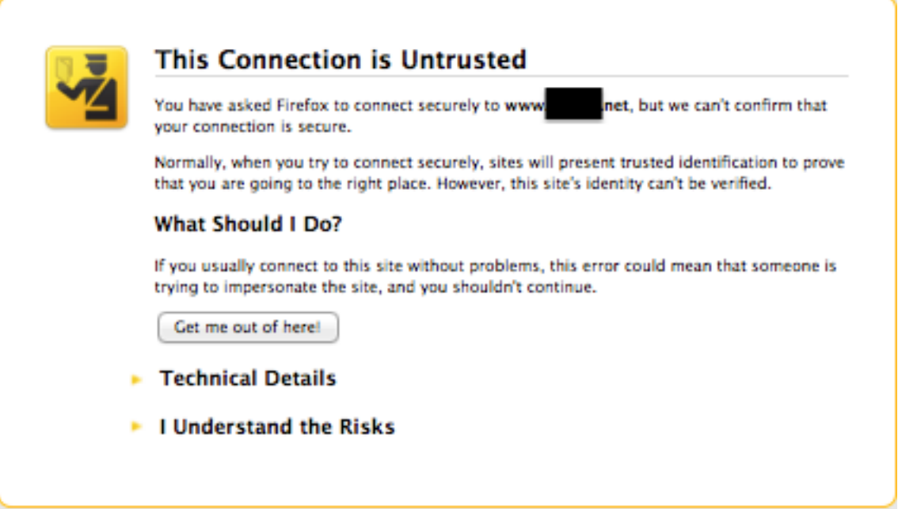
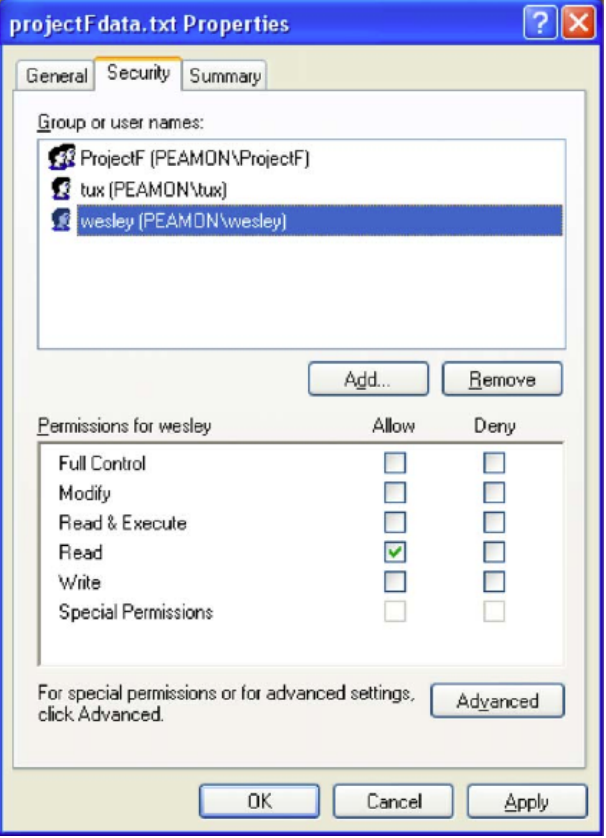

# User Interface (UI)

## Mental Model
### Prompt
> How likely are users to read the message?

### Warning Fatigue
> `Dialog box`

> A window in which resides a button labeled ”OK” and a variety of text and other content that users ignore.

### Interface Design

* What happens if neither `allow` nor `deny` is checked?
* How do users and groups permission interact if there's conflict?
* Difference between `write` and `modify`?